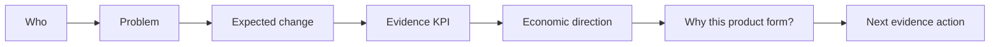

<div align="center">

# Valence Product Value Lens

**Turn a digital product story into a testable value-realization hypothesis in about three minutes.**

Identify who the product serves, what should change, what evidence matters, how value could become economic, and whether the current product form is justified.

[](https://github.com/fzfclee/valence-product-value-lens/actions/workflows/validate.yml)
[](SKILL.md)
[](https://github.com/fzfclee/valence-product-value-lens/stargazers)
[](LICENSE)

[30-second start](#30-second-start) · [See the lens](#the-value-lens) · [Example](#example-output) · [Quality evidence](#quality-evidence) · [中文](README.zh-CN.md) · [Valence](https://www.o2vframework.com/en/valence)

</div>

---

## Why This Lens

Digital product conversations often stop too early:

- “It launched” is treated as value.
- Usage is reported without showing what behavior or outcome changed.
- Productivity is counted as saving even when no spend or capacity changes.
- Branding, platform reuse, or risk reduction is asserted without an evidence path.
- The current app, dashboard, or mini-program is assumed to be the right product form.

Valence Product Value Lens gives an AI agent a compact, evidence-disciplined way to challenge those shortcuts and produce one usable value hypothesis.

## 30-Second Start

### Codex

```powershell
git clone https://github.com/fzfclee/valence-product-value-lens.git "$env:USERPROFILE\.codex\skills\valence-product-value-lens"
```

Start a new task and ask:

```text
$valence-product-value-lens
Help me assess the value hypothesis and data readiness of this digital product:
[describe the product without sensitive data]
```

### Other AI Agents

Copy [`SKILL.md`](SKILL.md) and its referenced Markdown files into the agent's skill or project-instruction folder. The repository is Markdown-first and has no runtime dependency.

## The Value Lens



The Lens asks one adaptive question at a time and produces:

| Decision question | Output |
|---|---|
| Who is the primary audience? | One primary audience |
| What problem matters most? | One main problem |
| What should change? | Observable behavior or outcome change |
| What would count as evidence? | Evidence KPI and current data gap |
| Where could economic value land? | One primary **Grow**, **Save**, or **Protect** direction |
| Why this form? | Product-form challenge and alternatives |
| What happens next? | Data-readiness level and next action |

## Grow, Save, Protect

Valence separates economic outcomes from value mechanisms:

| Economic outcome | Meaning | Example evidence path |
|---|---|---|
| **Grow** | Increase revenue, profit, or cash inflow | Incremental conversion × unit contribution margin |
| **Save** | Reduce or avoid cost and resource consumption | Verified net time saved × realizable cost or capacity |
| **Protect** | Reduce revenue loss, risk loss, or interruption loss | Potential impact × baseline probability × expected reduction |

Productivity, experience, decision quality, branding, time criticality, platform reuse, learning, and strategic capability are mechanisms. The Lens asks how they connect to Grow, Save, or Protect before treating them as an economic value claim.

## Use It When

| Situation | What the Lens helps decide |
|---|---|
| A product exists but its value story is vague | What outcome and evidence should anchor the story |
| Adoption is low | Whether the issue is audience, problem, behavior change, or product form |
| ROI is requested too early | Which data is missing before a directional estimate is credible |
| A platform claims reuse value | What downstream dependency and double-counting risks need checking |
| A compliance product looks “low usage” | Whether Protect value matters more than adoption volume |
| A standalone app or mini-program is being questioned | Whether another delivery form could create the same value |

Use it for one digital product and an early value conversation. Formal ROI approval, portfolio prioritization, investment decisions, and lifecycle governance require a broader review.

## Example Output

**Input**

```text
We have a brand mini-program that publishes official product information, but traffic is low.
I do not know how to explain its value.
```

**Condensed result**

```markdown
Primary audience: prospective customers comparing products.
Main problem: trusted product information is difficult to find at the decision moment.
Expected change: more qualified visitors reach verified information and continue to a purchase path.
Primary economic direction: Grow, still unvalidated.
Evidence KPI: qualified visits that continue to retailer, lead, or purchase actions.
Directional logic: qualified incremental journeys × conversion uplift × contribution margin.
Product-form question: does this require a standalone mini-program, or would the official website,
retailer integration, H5, or an existing platform provide the same trusted path?
Data readiness: Level 1, value-realization draft ready.
Next action: connect traffic sources to downstream actions and test one decision-stage use case.
```

The Lens does not assume that “branding” is automatically valuable or that the current product form should be preserved.

## Works With

| Agent / tool | Recommended setup |
|---|---|
| Codex | Local skill folder |
| Claude Code | Project or personal skill folder |
| Claude Projects | Project Instructions plus referenced files |
| Cursor / Windsurf | Project rules or reusable instructions |
| Hermes / OpenClaw / WorkBuddy | Markdown skill folder or reusable instruction |

See [`runtime_compatibility.md`](runtime_compatibility.md) for the portable runtime contract.

## Quality Evidence

This repository separates structural checks from scenario evidence:

- **Automated repository validation:** required files, UTF-8, frontmatter, internal Markdown links, core value rules, and referenced assets are checked on every push and pull request.
- **Adaptive regression case:** [`tests/adaptive_regression.md`](tests/adaptive_regression.md) checks that the next question changes when the user selects a platform use case.
- **Three documented scenarios:** [`tests/three_scenario_tests.md`](tests/three_scenario_tests.md) covers sales execution, compliance/risk control, and platform enablement.
- **Worked examples:** [`examples.md`](examples.md) shows how value mechanisms, monetization direction, data maturity, and guardrails appear in practice.

Run the local structural validation:

```powershell
python scripts/validate_repo.py
```

## Repository Map

| File | Purpose |
|---|---|
| [`SKILL.md`](SKILL.md) | Runtime instructions and guardrails |
| [`conversation_flow.md`](conversation_flow.md) | Adaptive one-question-at-a-time flow |
| [`value_taxonomy.md`](value_taxonomy.md) | Grow / Save / Protect and value mechanisms |
| [`data_checklists.md`](data_checklists.md) | Minimum evidence and monetization data |
| [`output_templates.md`](output_templates.md) | Standard result structure |
| [`examples.md`](examples.md) | Worked examples |
| [`tests/`](tests) | Documented regression and scenario cases |

## Valence And O2V

This repository contains the standalone public Valence Product Value Lens for lightweight, single-product value framing.

[Valence Product Value Operations & Governance](https://www.o2vframework.com/en/valence) is the broader model for value-realization design, planned and recognized value, adoption, investment efficiency, portfolio review, and lifecycle decisions. Valence is part of the [O2V Framework](https://www.o2vframework.com/), which connects opportunity signals to evidence-backed action and realized value.

The repository's original Markdown skill, examples, and supporting text are available under the [MIT License](LICENSE). Valence and O2V methodology assets are maintained separately under the rights statement in [`NOTICE.md`](NOTICE.md).

## Contributing

Scenario cases, compatibility notes, clearer evidence guardrails, and portability improvements are welcome. Read [`CONTRIBUTING.md`](CONTRIBUTING.md) before opening a pull request.

For methodology or advisory enquiries:

- Chinese: WeChat `lizhi_ch`
- English: [Zhi Li on LinkedIn](https://www.linkedin.com/in/li-zhi/)

---

<div align="center">

**A launch is an event. Value is an evidenced change.**

If the Lens helps sharpen a product decision, star the repository so other product teams can find it.

</div>
